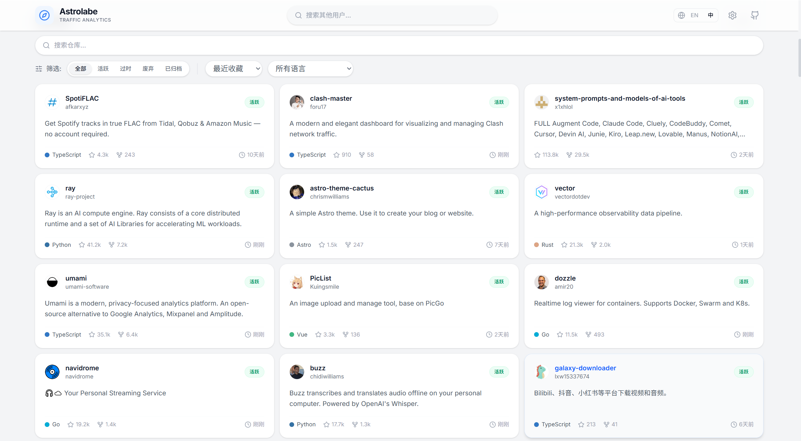
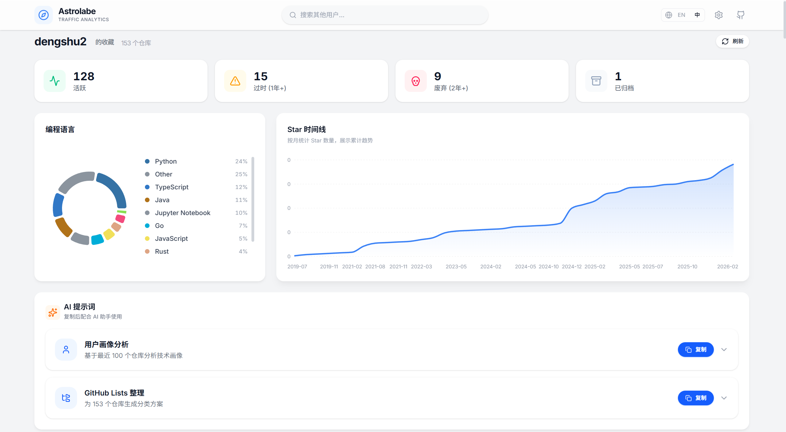

<div align="center">
  <h1 align="center">Astrolabe</h1>
  <p align="center">Visualize any GitHub user's starred repositories. Enter a username, get instant insights.</p>
  <p align="center">
    <a href="https://astrolabe.dengshu.ovh/"><strong>Explore the Live Demo »</strong></a>
  </p>
</div>

<div align="center">
   <a href="./README.md">English</a> | <a href="./README_ZH.md">简体中文</a>
</div>

---

## 📋 Table of Contents

- [✨ Features](#-features)
- [📸 Preview](#-preview)
- [🚀 Quick Start](#-quick-start)
- [🛠️ Tech Stack](#%EF%B8%8F-tech-stack)
- [📁 Project Structure](#-project-structure)
- [📄 License](#-license)

## ✨ Features

- **Language Distribution**: Visualize programming language usage across starred repositories.
- **Star Timeline**: Interactive timeline chart showing when repositories were starred.
- **Repository Health**: Automatically classify repositories as active, stale, abandoned, or archived.
- **Search & Filter**: Powerful search capabilities to find specific starred repositories instantly.
- **Direct Navigation**: One-click access to the original GitHub repository.
- **No Auth Required**: Works directly with GitHub's public API without needing personal access tokens.

## 📸 Preview

### Dashboard Overview


### Repository Details


### Kanban & AI Prompts


## 🚀 Quick Start

### Option 1: Docker Compose (Recommended)

1. Clone the repository:
   ```bash
   git clone https://github.com/dengshu2/Astrolabe.git
   cd Astrolabe
   ```

2. Create the required network:
   ```bash
   docker network create npm-network || true
   ```

3. Start the application:
   ```bash
   docker-compose up -d
   ```

4. Open your browser and visit [http://localhost:3002](http://localhost:3002)

### Option 2: Run from Source

1. Clone the repository:
   ```bash
   git clone https://github.com/dengshu2/Astrolabe.git
   cd Astrolabe
   ```

2. Install dependencies:
   ```bash
   npm install
   ```

3. Start the development server:
   ```bash
   npm run dev
   ```

4. Open your browser and visit [http://localhost:5173](http://localhost:5173) (default Vite port)

## 🛠️ Tech Stack

- **Frontend Framework**: React 19
- **Language**: TypeScript
- **Build Tool**: Vite
- **Styling**: Tailwind CSS 4
- **Visualization**: Recharts
- **API Integration**: Octokit
- **Icons**: Lucide React

## 📁 Project Structure

```bash
Astrolabe/
├── dist/                # Production build artifacts
├── images/              # Project screenshots
├── public/              # Static assets
├── src/                 # Source code
│   ├── components/      # React components
│   ├── hooks/           # Custom React hooks
│   ├── types/           # TypeScript type definitions
│   └── utils/           # Utility functions
├── docker-compose.yml   # Docker Compose configuration
├── Dockerfile           # Docker build instructions
├── index.html           # Entry HTML file
├── package.json         # Project metadata and dependencies
├── tsconfig.json        # TypeScript configuration
└── vite.config.ts       # Vite configuration
```

## 📄 License

This project is licensed under the MIT License. See the [LICENSE](./LICENSE) file for details.
