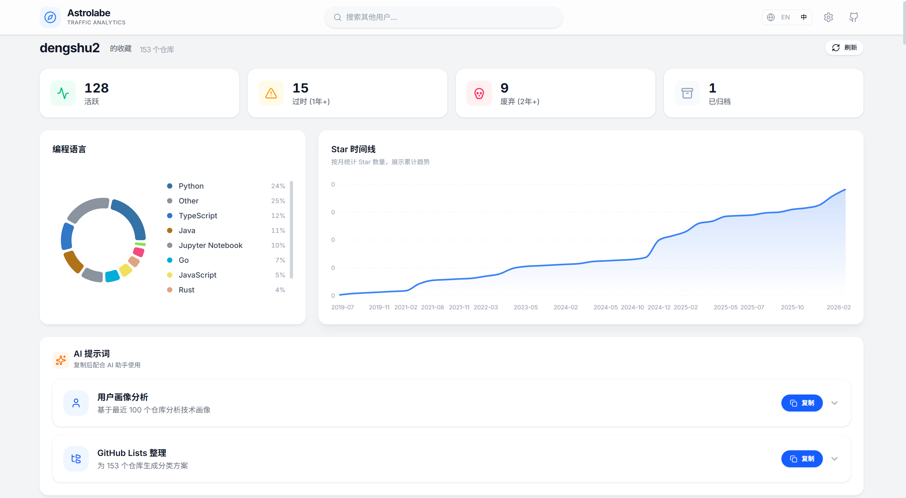

<div align="center">
  <h1 align="center">Astrolabe</h1>
  <p align="center">可视化任何 GitHub 用户的 Star 仓库。输入用户名，立即获取洞察。</p>
  <p align="center">
    <a href="https://astrolabe.dengshu.ovh/"><strong>在线演示 »</strong></a>
  </p>
</div>

<div align="center">
   <a href="./README.md">English</a> | <a href="./README_ZH.md">简体中文</a>
</div>

---

## 📋 目录

- [✨ 功能特性](#-功能特性)
- [📸 预览](#-预览)
- [🚀 快速开始](#-快速开始)
- [🛠️ 技术栈](#%EF%B8%8F-技术栈)
- [📁 项目结构](#-项目结构)
- [📄 许可证](#-许可证)

## ✨ 功能特性

- **语言分布**: 可视化展示 Star 仓库的编程语言使用情况。
- **Star 时间轴**: 交互式时间轴图表，展示仓库被 Star 的时间趋势。
- **仓库健康度**: 自动将仓库分类为活跃、陈旧、废弃或已归档状态。
- **搜索与过滤**: 强大的搜索功能，快速查找特定的 Star 仓库。
- **直接跳转**: 一键跳转至原始 GitHub 仓库页面。
- **无需认证**: 直接使用 GitHub 公共 API，无需个人访问令牌（Personal Access Token）。

## 📸 预览

### 仪表盘概览


### 仓库详情


### 看板与 AI 提示词


## 🚀 快速开始

### 方式一：Docker Compose（推荐）

1. 克隆仓库：
   ```bash
   git clone https://github.com/dengshu2/Astrolabe.git
   cd Astrolabe
   ```

2. 创建所需的反向代理网络：
   ```bash
   docker network create proxy-network || true
   ```

3. 启动服务：
   ```bash
   docker-compose up -d
   ```

4. 打开浏览器访问 [http://localhost:3002](http://localhost:3002)

### 方式二：源码运行

1. 克隆仓库：
   ```bash
   git clone https://github.com/dengshu2/Astrolabe.git
   cd Astrolabe
   ```

2. 安装依赖：
   ```bash
   npm install
   ```

3. 启动开发服务器：
   ```bash
   npm run dev
   ```

4. 打开浏览器访问 [http://localhost:5173](http://localhost:5173) (默认 Vite 端口)

## 🛠️ 技术栈

- **前端框架**: React 19
- **开发语言**: TypeScript
- **构建工具**: Vite
- **样式方案**: Tailwind CSS 4
- **数据可视化**: Recharts
- **API 集成**: Octokit
- **图标库**: Lucide React

## 📁 项目结构

```bash
Astrolabe/
├── dist/                # 生产环境构建产物
├── images/              # 项目截图
├── public/              # 静态资源
├── src/                 # 源代码
│   ├── api/             # GitHub API 客户端
│   ├── components/      # 通用 UI 组件
│   ├── features/        # 功能模块（看板、仓库、提示词、落地页）
│   ├── hooks/           # 自定义 Hooks
│   ├── i18n/            # 国际化（中 / 英）
│   ├── lib/             # 工具函数、缓存、常量
│   └── types/           # TypeScript 类型定义
├── docker-compose.yml   # Docker Compose 配置
├── Dockerfile           # Docker 构建说明
├── index.html           # 入口 HTML 文件
├── package.json         # 项目元数据和依赖
├── tsconfig.json        # TypeScript 配置
└── vite.config.ts       # Vite 配置
```

## 📄 许可证

本项目采用 MIT 许可证。详情请参阅 [LICENSE](./LICENSE) 文件。
